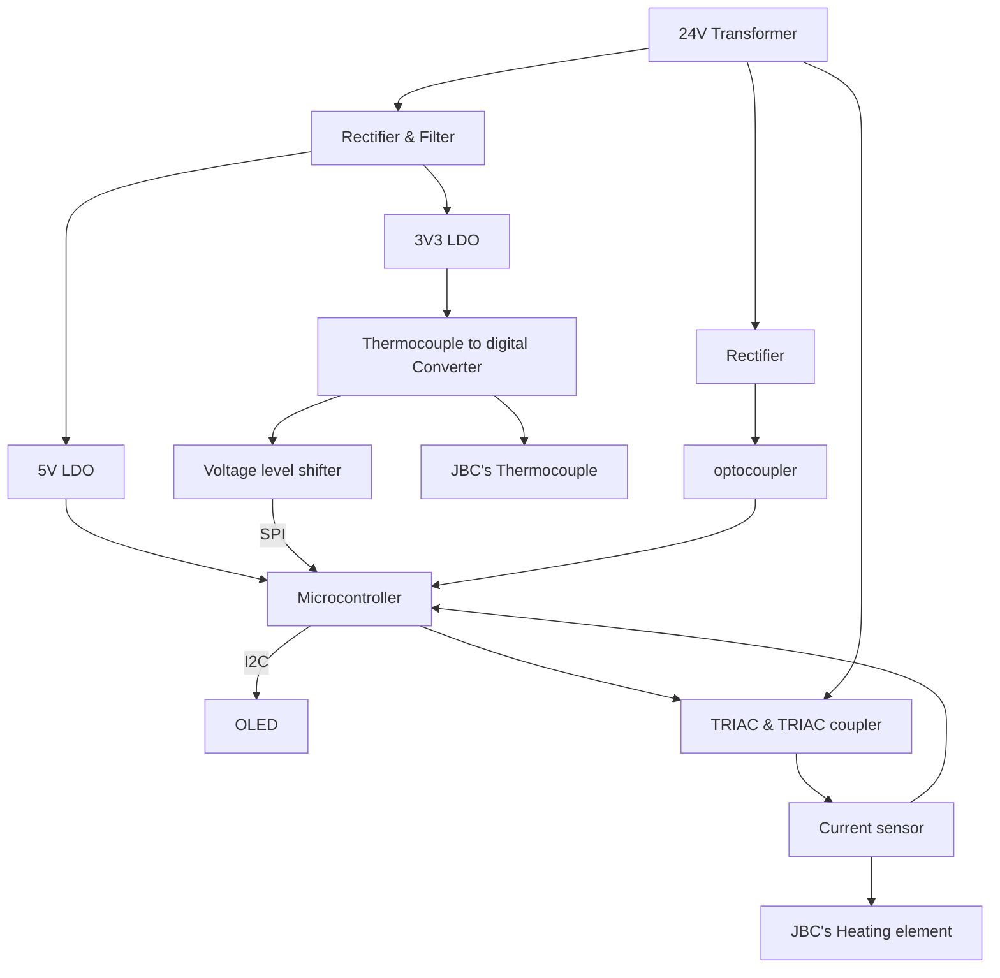

> Project repo Available here [here](https://github.com/Krishnawa/BEEIRON).
{: .prompt-info }
## Story
In the past few years, I had been using a Solderon 25W/230V soldering iron for all my soldering work. However, I decided to upgrade to a temperature-controlled soldering iron. While searching for a good temperature-controlled soldering iron, I had the idea of making one myself.

I began browsing the internet and came across the JBC brand, which had a nice selection of soldering irons. Eventually, I purchased a JBC handle that is compatible with JBC T245 cartridges.

It turned out that the process was not as easy as I initially thought. I encountered numerous challenges along the way, especially considering that this particular version, v0.0.4, is still in beta and not ready for production. In this blog, I will outline the challenges I faced, the mistakes I made, and discuss the issues with the previous version as well as the present one. Additionally, I will address the changes that need to be made in the next revision.

## 1. Features and specification 
- Using [T245](https://www.jbctools.com/t245-a-general-purpose-handle-product-45.html) General Purpose Handle.
- Using [C245938 - Spoon Cartridge Ø 3.8](https://www.jbctools.com/c245938-spoon-cartridge-o-38-product-397.html) 
- Achieve Room temp - 300 °C in 2 Seconds!
- The soldering station has a 0.96' OLED display.
- For setting/adjusting the temperature it has a pot.
- It has capability of the live power measurement.
- Replace default connector of JBC 245 with [GX-16](https://www.digikey.com/en/products/detail/sparkfun-electronics/PRT-11475/7918936) 5 Pin connector

## 2. Simplified block diagram

## 3. Components 
### 3.1 JBC T245 Spoon Cartridge Ø 3.8
_Completa.gif) _C245938 Spoon Cartridge Ø 3.8_

The JBC T245 Spoon Cartridge Ø 3.8 is a soldering iron cartridge designed for use with JBC soldering stations. Here are the specifications for this specific cartridge

| Attribute               | Details              |
|:------------------------|---------------------:|
| Cartridge Type          | T245 Spoon Cartridge |
| Cartridge Diameter      | 3.8 mm               |
| Weight                  | 7 gr (0.02 lb)       |
|Dimension                |110 x 12 x 12 mm      |
|Resistance               |1-3Ω                  |
|Thermocouple             |N Type (Probably)     |

- JBC soldering stations that support the T245 series cartridges
- It contains a heating element at the top of its tip that rapidly heats up to the desired temperature.
- The temperature range may vary based on the specific soldering station, but typically JBC cartridges can reach temperatures up to 450°C (842°F).
- The spoon cartridge is commonly used for precise soldering tasks that require the transfer and application of small amounts of solder or for working with components that require careful soldering techniques.
- JBC cartridges are known for their long lifespan and durability due to the use of high-quality materials and advanced manufacturing processes.
### 3.2   ATMEGA328

_8-bit Microcontrollers - MCU 32KB In-system Flash 20MHz 1.8V-5.5V_

#### Specification

|Attributes               | Description  |
|:------------------------|-------------:|
|Program Memory Type	    |Flash         |
|Program Memory Size (KB)	|32            |
|CPU Speed (MIPS/DMIPS)	  |20            |
|Data EEPROM (bytes)	    |1024          |
|Timers	            |2 x 8-bit 1 x 16-bit|
|Stand alone PWM	        |6             |
|ADC Channels	            |8             |
|Max ADC Resolution (bits)|10            |
|Number of Comparators	  |1             |
|Temp. Range Min.	        |-40           |
|Temp. Range Max.	        |85            |
|Operation Voltage Max.(V)|5.5           |
|Operation Voltage Min.(V)|1.8           |
|Pin Count	              |32            |
|Low Power	              |Yes           |
|I2C	                    |1             |
|SPI	                    |1             |

#### Why Atmega328?
At the time of this project I was very comfortable with Arduino platform so I decided to use the Atmega328. Since it doesn't have any complicated toolchain setup it's really easy to work with Arduino IDE also it have many resources and supports are available

While doing this project I created a pinout document for ATMEGA328, If you are interested check below.

> Atmega328 pinout available [here](https://github.com/Krishnawa/ATMEGA328P-TQFP32-PINOUT).
{: .prompt-tip }

## 4. Schematic

## 5. code
## 6. Previous versions vs Current version and Challenges

## 7. Next Revision Changes

## 8. Reference